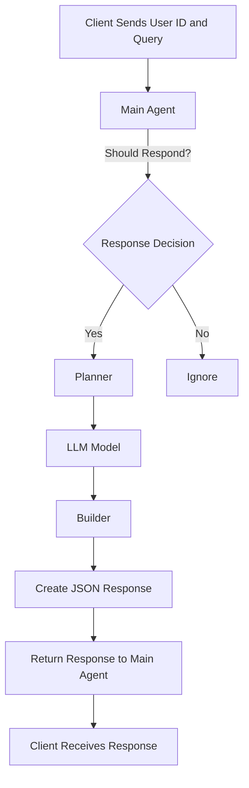

# Update Plan for Chat Application with WebSocket

## Overview
This plan outlines the steps to convert the existing project into a chat application using WebSockets. The application will allow clients to send user IDs and queries, which will be processed by a main agent, planner, and builder.

## Flow Diagram

## Detailed Steps

1. **Main Agent**:
   - Modify the `handleCommand` method in `BotAvatar` to check if a response should be generated using a new method `generateShouldRespond`.
   - If the response is not needed, return an "ignore" message.

2. **Planner**:
   - Create a new class `Planner` that will take the user query and send it to the specified LLM model.
   - The planner will return the output to the builder.

3. **Builder**:
   - Create a new class `Builder` that will take the output from the planner and format it into a valid JSON response.
   - The builder will output this JSON response back to the main agent.

4. **Integration**:
    - Ensure that the main agent, planner, and builder are integrated into the existing WebSocket server.
    - Update the WebSocket message handling to accommodate the new workflow.
    - **Worker Initialization**:
        - For each worker, call the `initEventBus` method during their initialization to ensure event handling is set up correctly.
    - **Graph Initialization**:
        - Remove the document retrieval step from the graph.
        - Focus on the planner and builder's input and output, using the event bus to communicate between steps.

